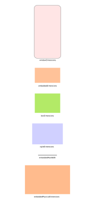

# A Deterministic Approach to Embedded Content Scaling

> :gem: _This RFC is part of project Foundry._

## The Problem

The way embedded content is scaled for best user experience is flaky, partly
because of its complexity, partly because it is unspecified.

## Problem Frame

To understand the problem frame, lets bring in some definitions.

| Variable                     | Unit      | Definition                                                             |
| ---------------------------- | --------- | ---------------------------------------------------------------------- |
| `windowDimensions`           | dpi       | The area of the device in which the UI elements can be drawn.          |
| `embeddedMaxWidth`           | dpi       | A prop which defines the maximum width of embedded content.            |
| `styleDimensions`            | dpi / CSS | Dimensions values inherited from different styles and / or attributes. |
| `drawBoxDimensions`          | dpi       | The dimensions of the drawn element in the rendering tree.             |
| `embeddedPhysicalDimensions` | pixel     | The original dimensions of the embedded object.                        |

